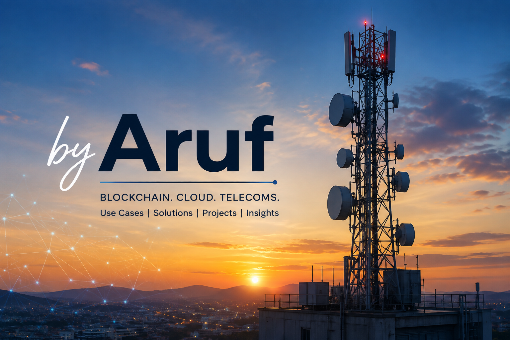

# Hi, I'm Aruf 👋

I'm a Telecommunications Engineer and software developer exploring the intersection of **Telecommunications, Blockchain, Cloud Computing, and Web Development.**

## What I Write About

📡 **Telecoms & Blockchain**
- Blockchain use cases in telecommunications
- Spectrum and frequency sharing
- MVNOs and decentralized infrastructure
- Web3 applications for telecom operators

☁️ **Cloud Computing**
- Cloud solutions for telecoms
- AWS infrastructure
- Serverless and scalable architectures
- Cloud-native telecom applications

💻 **Web Development**
- Full-stack applications
- Backend systems and APIs
- Web3 applications
- Projects I've built and lessons learned

## Featured Work

🔗 **Blockchain + Telecoms**  
Research and projects exploring how blockchain can solve real problems in telecommunications.

☁️ **Cloud + Telecoms**  
Practical cloud architectures and solutions for telecom infrastructure.

💻 **Software Projects**  
A collection of applications, experiments and things I'm building.

## Connect With Me

🌐 [Website](https://aruf.xyz)

💼 [LinkedIn](https://www.linkedin.com/in/maarufyusuf)

𝕏    [X/Twitter](https://x.com/TechieAruf)

📧 Email: yusufmaaruf3@gmail.com

